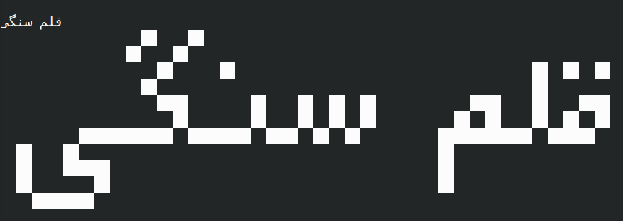
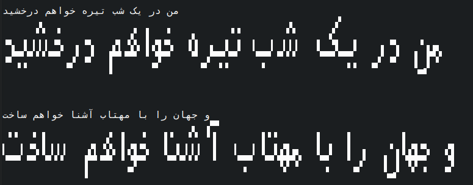

## فونت های آراسته
### X:

  
این فونت بر اساس فونت نیما ساخته شده است.

### sangi:

قلم سنگی که برپایهٔ قلم پیکسلی [عرفان](https://github.com/ekm507/erfan-font) ساخته شده است.

### sangi_mini:

قلم سنگی کوچک که برپایهٔ قلم پیکسلی [عرفان](https://github.com/ekm507/erfan-font) ساخته شده است.
### Mahni:

### Six-Z:

  
