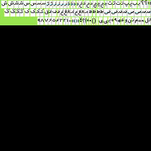

# راهنمای استفاده از ابزارهایی برای ساخت قلم

در این مسیر ابزارهای مختلفی قرار می‌گیرد که می‌تواند به شما در ساخت قلم کمک کند.

# ابزار flf2aff2
این ابزار قلم‌های flf را به قلم‌های aff2 تبدیل می‌کند.

این ابزار اسم فایل را به‌عنوان آرگومان دریافت می‌کند و نتیجه را به خروجی استاندارد می‌دهد. پس خروجی آن را باید در یک فایل بریزید.

برای استفاده از آن:
```bash
python3 flf2aff2.py myfont.flf > myfont.aff
```

## ابزار py2flf

برای طراحی قلم می‌توانید هر قلم را در یک فایل پایتون تعریف کنید. سپس با این ابزار می‌توانید آن را به یک قلم flf تبدیل کنید.

### ساختار قلم پایتون

این فایل شامل یک آبجکت پایتون از نوع دیکشنری است که یک رشته که نمایانگر نویسه در حالت مشخصی است را به یک رشتهٔ دیگر که نمایانگر بلوک مربوطه است نگاشت می‌دهد.

هم‌چنین شمارهٔ خط کرسی هم در یک متغیر عددی به اسم korsi مشخص می‌شود. یک نمونه از چنین قلمی را می‌توانید در فایل `font_example.py` ببینید.

### تبدیل قلم

حال برای تبدیل این فایل به یک فایل flf از اسکریپت py2flf.py استفاده کنید.
ابتدا این فایل را باز کنید و مقادیر `my_name` و `comment` را ویرایش کنید. اولی اسم شما و دومی توضیحات قلم است.

سپس این اسکریپت را اجرا کنید و اسم فایل قلم را به آن بدهید. برای مثال:

```bash
$ python3 py2flf.py myfont.py
```

خروجی این در ترمینال شما چاپ می‌شود. پس برای ذخیره آن در یک فایل چنین عمل کنید:

```bash
$ python3 py2flf.py myfont.py > myfont.flf
```

با اجرای این دستور سرآیند و بلوک‌های قلم ساخته خواهد شد.

## ابزار ttf_character_to_png

برای طراحی قلم می‌توانید از قلم‌های trueType موجود استفاده کنید و آن‌ها را به هنر اسکی تبدیل کنید.

با این ابزار می‌توانید یک یا چند نویسه از یک قلم موجود را روی یک تصویر png بیاورید.

برای استفاده از این ابزار نیاز به کتاب‌خانهٔ PIL پایتون دارید.

درواقع این کار را می‌توانید با نرم‌افزارهای ویرایش عکس نیز انجام بدهید ولی استفاده از این ابزار کار را خودکار و راحت می‌کند.

برای استفاده از این ابزار ابتدا آن را باز کنید و روبروی `font_path` مسیر یک قلم ttf را به آن بدهید.

سپس ابزار را چنین استفاده کنید:

```bash
python3 ttf_character_to_png.py <نویسهٔ موردنظر>
```

خروجی این ابزار یک تصویر است که در مسیر جاری ذخیره می‌شود.

## ابزار drawfont

با این ابزار می‌توانید یک قلم ttf را به یک قلم اسکی با فرمت پایتون تبدیل کنید.

برای استفاده از این ابزار نیاز دارید ابزار jp2a در سیستم شما نصب باشد. هم‌چنین این ابزار از ttf_character_to_png استفاده می‌کند که برای استفاده از آن لازم است کتاب‌خانهٔ PIL پایتون نیز نصب باشد.

برای استفاده ابتدا آن را باز کنید و مقادیر `characters` و `korsi` را تنظیم کنید. اولی فهرستی از همهٔ نویسه‌هایی است که این ابزار قرار است تولید کند. دومی شمارهٔ خط کرسی است که باید آن را با نگاه کردن به خروجی برنامه پیدا کنید!

اجرای این برنامه ممکن است قدری طول بکشد. این برنامه خروجی‌اش را که متن یک کد پایتون است در ترمینال می‌نویسد پس آن را باید در یک فایل بریزید. مثل این:

```bash
$ python3 drawfont.py >> myfont.py
```

البته می‌توانید در فایل ایجاد شده نیز مقدار متغیر `korsi` را تنظیم کنید.

## ابزار make_py_template

با این ابزار می‌توانید فهرستی از همهٔ نویسه‌های موردنظر را به‌شکل یک دیکشنری پایتون ایجاد کنید تا بتوانید نویسه‌های خود را در آن طراحی کنید.

برای استفاده آن را باز کنید و در `characters` فهرست نویسه‌هایی که می‌خواهید ایجاد شوند را بنویسید.

سپس برنامه را اجرا کنید و خروجی آن را در یک فایل بریزید. دقت کنید که این ابزار نویسه‌های دیگر پایتون مثل `{` را نمی‌نویسد و خودتان باید آن‌ها را اضافه کنید.

```bash
$ python3 make_py_template.py >> my_font.py
```

## ابزار pixelart_to_py

با کمک این ابزار می‌توانید یک هنر پیکسلی (pixel-art) را به قلم اسکی تبدیل کنید!

### ترسیم تصویر پیکسلی از گلیف‌های قلم

برای این کار ابتدا باید در یک تصویر با فرمت png گلیف‌های قلم خود را ترسیم کنید. بیشینهٔ ارتفاع هر گلیف باید مقدار ثابتی باشد. ردیف اول پیکسل‌های تصویر را با رنگ سبز بزنید و مشابه شکل زیر، پایین ردیف نویسه‌ها را هم سبز کنید.



می‌توانید نویسه‌ها را در چند ردیف در تصویر بچینید. فقط باید انتهای هر ردیف را با رنگ سبز پر کنید. برای ترسیم گلیف‌ها از رنگ سیاه و برای زمینه از رنگ سفید استفاده کنید. می‌توانید رنگ‌های دیگری را نیز به‌عنوان راهنما به کار ببرید. آن‌ها برای برنامه اهمیتی ندارند.

### تنظیمات اسکریپت باتوجه‌به قلم
حال فایل `pixelart_to_py.py` را ویرایش کنید. موارد زیر را تنظیم کنید.

- در متغیر `image_name` مسیر تصویر خودتان را بدهید.
- در متغیر `num_of_raws` تعداد ردیف‌هایی که در آن‌ها گلیف‌ها را ترسیم کرده‌اید مشخص کنید. مثلاً در این تصویر ۳ ردیف نویسه وجود دارد.
- متغیر `image_width` قاعدهٔ تصویر شما برحسب پیکسل است.
- مقدار `korsi` شمارهٔ خط کرسی شما را مشخص می‌کند. اگر این
- متغیر `maxwidth` بیشینهٔ طول یک گلیف را تعیین می‌کند اما از آن در این برنامه استفاده نشده است پس می‌توانید از آن رد شوید.
- آبجکت `characters` یک لیست از همهٔ نویسه‌هایی است که گلیف‌های آن‌ها را ترسیم کرده‌اید. این فهرست گلیف‌ها را از سمت راست و بالای تصویر به سمت چپ می‌شمارد. این‌جا برای مشخص کردن شکل چسبان یک نویسه، آن را با یک یا دو نویسهٔ «اتصال مجازی» در اول و آخرش همراه کنید. اتصال مجازی در صفحه‌کلید استاندارد فارسی کنار عدد ۱ و روی کلید backtick قرار دارد.
- متغیر `comment` در این برنامه استفاده نشده است پس از آن عبور کنید.
- متغیرهای `char_for_zero` و `char_for_one` مشخص می‌کنند که به‌جای پیکسل‌های سیاه و سفید در تصویر، چه نویسه‌هایی باید قرار گیرد. این رشته‌ها می‌توانند یک یا چند نویسه داشته باشند.

### تبدیل هنر پیکسلی به هنر اسکی

حال برنامه را اجرا کنید! خروجی برنامه در ترمینال چاپ می‌شود. پس می‌توانید آن را در یک فایل بریزید. مانند زیر.

```bash
$ python3 pixelart_to_py.py > my_font.py
```

خروجی این برنامه یک قلم در فرمت پایتونی است که آن را می‌توانید با ابزارهای دیگری که در این مخزن در اختیار شما قرار دارند تبدیل به یک قلم اسکی کنید!

## ابزار pixelart_to_py_mini

با این ابزار می‌توانید مشابه ابزار pixelart_to_py یک پیکسل‌آرت را تبدیل به یک قلم اسکی کنید.

تفاوت این‌جاست که گلیف‌ها در قلم خروجی این برنامه اندازهٔ کوچکتری دارند چرا که با استفاده از نویسه‌هایی مثل «▛ و ▞» هر ۴ پیکسل روی یک مربع تبدیل به یک نویسه شده‌اند.

تنظیمات این برنامه و نحوهٔ آن مشابه ابزار pixelart_to_py است با این تفاوت که نیازی به تنظیم `char_for_zero` و `char_for_one` وجود ندارد و برنامه از آن‌ها استفاده نمی‌کند.